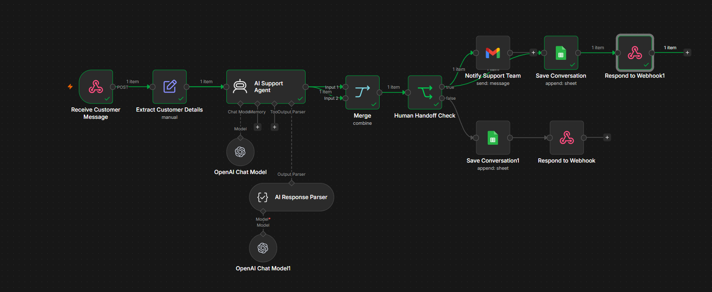
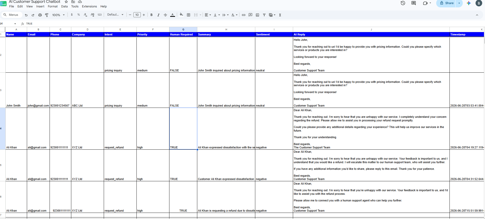
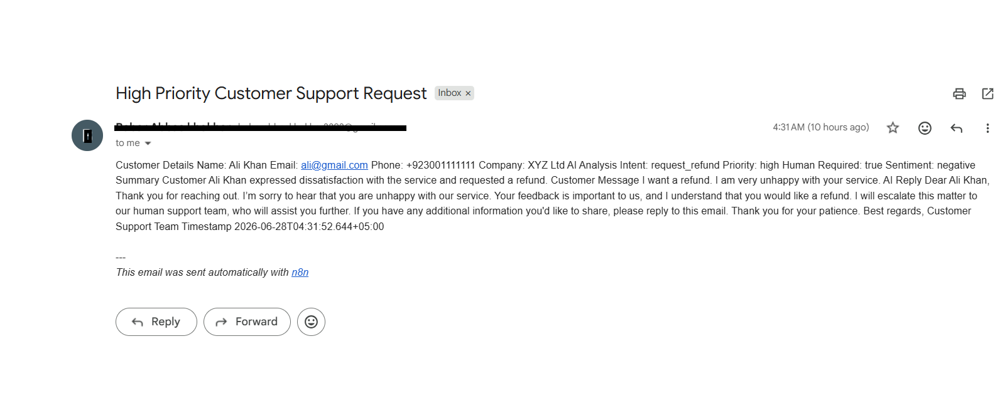

# 🤖 AI Customer Support Chatbot

An AI-powered customer support automation workflow built with **n8n**, **OpenAI**, **Gmail**, **Google Sheets**, and **Webhooks**.

This workflow automatically analyzes customer inquiries, detects intent, classifies priority, performs sentiment analysis, generates AI-powered responses, escalates high-priority requests to a human support team, and logs every conversation into Google Sheets.

---

# ✨ Features

* 🤖 AI-powered customer inquiry analysis
* 🎯 Intent detection
* ⚡ Priority classification
* 😊 Sentiment analysis
* 💬 Automatic AI response generation
* 👨‍💼 Human handoff for critical cases
* 📧 Gmail notification for high-priority requests
* 📊 Google Sheets conversation logging
* 🌐 Webhook API integration
* 📦 Structured JSON output using Output Parser

---

# 🛠️ Tech Stack

* n8n
* OpenAI GPT
* Gmail API
* Google Sheets API
* Webhooks
* JSON Output Parser

---

# 🏗️ Workflow Architecture

The following workflow demonstrates the complete customer support automation process.



---

# 📊 Google Sheets Logging

Every customer interaction is automatically logged into Google Sheets for reporting and future reference.



---

# 📧 Gmail Human Handoff

Whenever a conversation is classified as high priority, the workflow automatically sends an email notification to the support team.



---

# ⚙️ Workflow Overview

1. Receive customer request through Webhook.
2. Extract customer information.
3. Analyze the message using OpenAI.
4. Detect:

   * Intent
   * Priority
   * Sentiment
   * Human handoff requirement
5. Merge AI output with the original customer information.
6. Check whether human escalation is required.
7. **If Human Handoff = TRUE**

   * Send Gmail notification
   * Save conversation to Google Sheets
8. **Otherwise**

   * Save conversation directly to Google Sheets
9. Return the AI response through the Webhook.

---

# 📁 Project Structure

```text
.
├── AI Customer Support Chatbot.json
├── README.md
├── LICENSE
└── images
    ├── workflow.png
    ├── google-sheet.png
    └── gmail-notification.png
```

---

# 🚀 Getting Started

1. Download the workflow JSON.
2. Import it into your n8n workspace.
3. Configure the following credentials:

   * OpenAI
   * Gmail OAuth2
   * Google Sheets
4. Update the Webhook URL.
5. Activate the workflow.
6. Send a test request.

---

# 💡 Use Cases

* AI Customer Support
* Help Desk Automation
* Customer Inquiry Classification
* Email Support Automation
* AI Response Generation
* Customer Ticket Routing
* Customer Service Automation

---

# 📥 Workflow File

The complete n8n workflow is included in this repository:

**AI Customer Support Chatbot.json**

Simply import the file into n8n and configure your credentials.

---

# 📜 License

This project is licensed under the MIT License.

⭐ If you found this project useful, consider giving it a star on GitHub.
